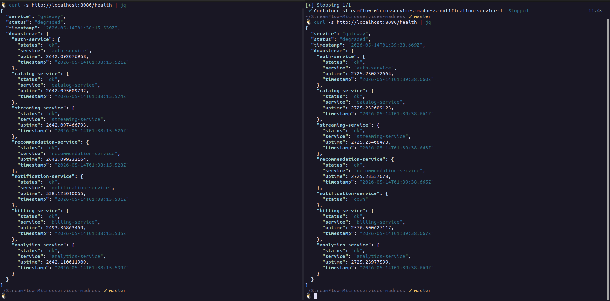
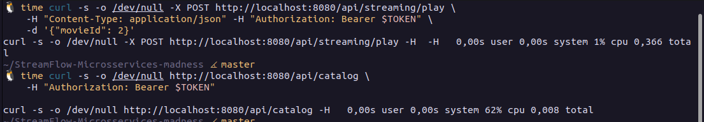
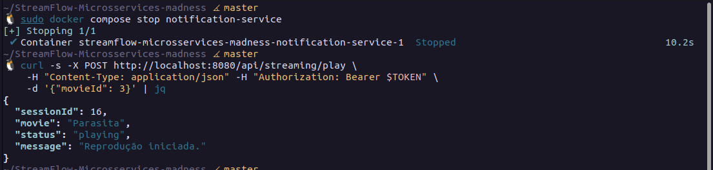
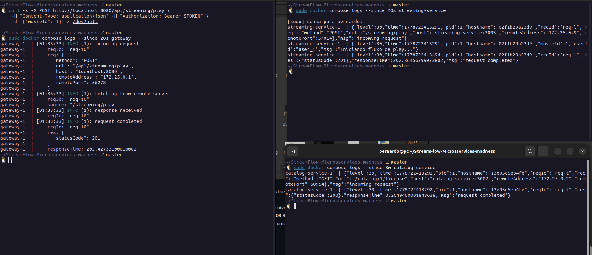
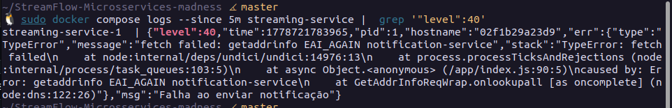
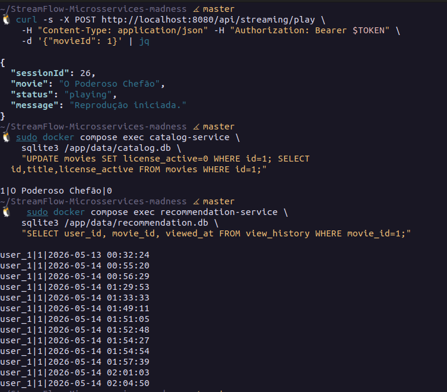
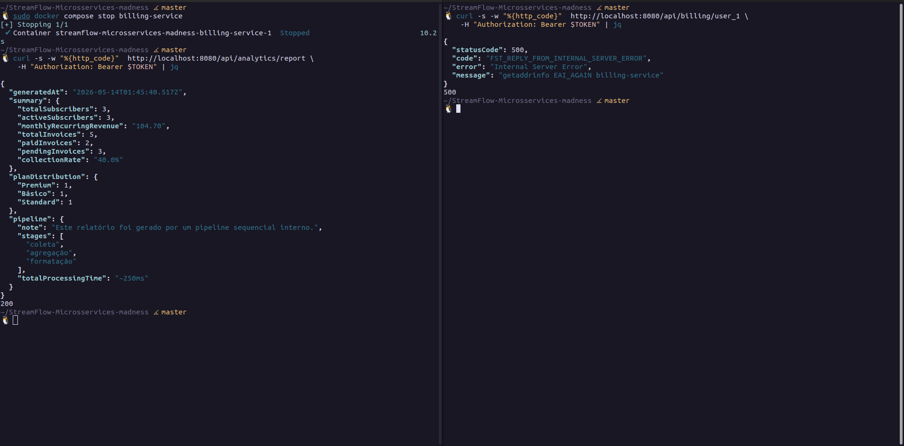

# Report de Análise Arquitetural — StreamFlow

**Disciplina:** Serviços Web  
**Professor:** Élder F. F. Bernardi  
**Data:** 12/05/2026  

---

## Contexto

Este report responde ao e-mail do VP de Produto, Marcos Oliveira, sobre os problemas de custo, complexidade operacional e observabilidade do StreamFlow. A análise foi realizada com base no código-fonte dos 8 componentes da arquitetura (gateway + 7 microsserviços), na especificação arquitetural (`arquitetura_streamflow_reference.md`) e nos cenários de teste descritos em `docs/DEBUG.md`.

---

## Seção 1 — Custo Operacional Oculto

> _"Temos mais gente mantendo infraestrutura do que escrevendo features."_

**Marcos está certo.** O custo de manutenção da infraestrutura atual cresce de forma desproporcional ao valor entregue.

### Diagnóstico

O StreamFlow opera com **8 componentes** (1 gateway + 7 serviços). Cada componente carrega seu próprio peso operacional:

| Componente         | Dockerfile | Pipeline CI/CD | Banco de dados       | Porta |
|--------------------|-----------|----------------|----------------------|-------|
| Gateway            | ✅         | ✅              | —                    | 8080  |
| Auth Service       | ✅         | ✅              | `auth.db`            | 3001  |
| Catalog Service    | ✅         | ✅              | `catalog.db`         | 3002  |
| Streaming Service  | ✅         | ✅              | `streaming.db`       | 3003  |
| Recommendation     | ✅         | ✅              | `recommendation.db`  | 3004  |
| Notification       | ✅         | ✅              | **Nenhum**           | 3005  |
| Billing Service    | ✅         | ✅              | `shared_billing.db`  | 3006  |
| Analytics Pipeline | ✅         | ✅              | `shared_billing.db`  | 3007  |

**Overhead operacional mensurável:**
- **8 Dockerfiles** para manter e atualizar (patches de segurança, atualizações de Node.js)
- **8 pipelines de CI/CD** independentes com build, teste e deploy
- **6 arquivos de banco de dados** (5 únicos, já que billing e analytics compartilham um)
- **8 endpoints `/health`** monitorados individualmente
- **8 configurações de rede** no Docker Compose (hostname, variáveis de ambiente, volumes)
- **8 superfícies de log** sem correlação entre si

### O caso do Notification Service

O `notification-service` é o candidato mais óbvio à eliminação como microsserviço independente. Ao analisar seu código (`services/notification/index.js`), constatamos:

- **Não possui banco de dados próprio** — é completamente stateless
- **Não executa lógica de negócio** — apenas simula um `setTimeout` de 100–300ms
- **Não precisa de deploy independente** — não tem estado para preservar
- **Gera overhead real sem benefício** — mantém container, pipeline, Dockerfile e porta de rede apenas para executar um `setTimeout`

Um serviço desse tipo deveria ser uma **biblioteca interna** ou uma **integração direta com um message broker** (Redis Pub/Sub, RabbitMQ), não um microsserviço com container próprio.

### Serviços candidatos à consolidação

| Serviço         | Diagnóstico                                              | Recomendação              |
|-----------------|----------------------------------------------------------|---------------------------|
| Notification    | Stateless, sem domínio próprio, no caminho síncrono crítico | Eliminar como serviço; usar fila assíncrona |
| Analytics       | Pipeline sequencial que lê banco do Billing diretamente  | Consolidar com Billing     |
| Billing         | Compartilha banco com Analytics, acoplamento já existente| Consolidar com Analytics   |

**Com essa consolidação:** de 7 microsserviços para 5, eliminando 2 Dockerfiles, 2 pipelines e o acoplamento de banco compartilhado. A equipe de 15 pessoas recupera ~20% do tempo gasto em manutenção de infraestrutura.

> **Evidência (teste local — 2026-05-13):** Cenário 4 do `docs/DEBUG.md` — `GET /health` agrega o status de todos os 8 componentes. Comparando o JSON antes e depois de `docker compose stop notification-service`, o agregado passa de `ok` para `degraded`, ilustrando os 8 endpoints individuais que a equipe precisa monitorar.
>
> 

### Proposta

1. **Eliminar o Notification Service** como microsserviço: substituir por publicação em fila de mensagens (ex.: Redis Pub/Sub) consumida por um worker dedicado.
2. **Consolidar Billing + Analytics** em um único serviço `financial-service` com banco próprio e endpoints separados.
3. **Manter Auth, Catalog, Streaming e Recommendation** como microsserviços — cada um tem domínio claro, banco independente e casos de escala distintos.

---

## Seção 2 — Latência de Rede

> _"Um clique no Play toca 12 serviços antes do vídeo iniciar."_

**Marcos exagera no número, mas o problema é real e grave.** O fluxo `POST /streaming/play` executa **3 chamadas HTTP síncronas e bloqueantes** antes de responder ao usuário.

### Diagnóstico: a cadeia síncrona

Lendo o código do `streaming-service` (`services/streaming/index.js`, linhas 56–103), o fluxo completo é:

```
Cliente
  → Gateway (validação JWT)
    → Streaming Service
        ├─ [PASSO 1] GET catalog-service/catalog/:id/license   ← SÍNCRONO, timeout 5s
        ├─ [PASSO 2] POST recommendation-service/viewed        ← SÍNCRONO, timeout 5s
        ├─ [PASSO 3] POST notification-service/notify          ← SÍNCRONO, timeout 5s
        │              └─ Simula 100–300ms de latência interna
        └─ [PASSO 4] INSERT sessions (banco local)
```

### Estimativa de latência

| Etapa                        | Latência estimada         |
|------------------------------|---------------------------|
| Validação JWT no gateway     | ~2ms                      |
| Hop gateway → streaming      | ~1–3ms (rede interna)     |
| Hop streaming → catalog      | ~2–5ms + processamento    |
| Hop streaming → recommendation| ~2–5ms + processamento   |
| Hop streaming → notification  | ~2–5ms + **100–300ms** de delay simulado |
| INSERT sessions local        | ~1ms                      |
| **Total adicional vs. rota simples** | **~110–320ms**    |

Para comparação, uma rota simples como `GET /api/catalog` percorre apenas 2 hops (gateway → catalog) e responde em ~5–10ms.

**O notification-service sozinho adiciona 100–300ms de latência ao fluxo de Play** — e esse delay está embutido no caminho crítico do usuário, que espera o vídeo iniciar.

> **Evidência (teste local — 2026-05-13):** Cenário 1 do `docs/DEBUG.md` — `time curl` em `POST /api/streaming/play` (cadeia síncrona com 3 chamadas downstream) versus `GET /api/catalog` (rota simples).
>
> | Endpoint | `real` |
> |---|---|
> | `POST /api/streaming/play` | **0,366s** |
> | `GET /api/catalog`         | **0,008s** |
>
> Diferença medida: **~358 ms** — acima da estimativa de 110–320 ms da tabela, confirmando que o caminho crítico do Play paga o custo das 3 chamadas síncronas (com destaque para os 100–300 ms simulados pelo notification-service).
>
> 

### Problema de resiliência

Além da latência, a cadeia cria **fragilidade em cascata**. Se o `recommendation-service` ou `notification-service` ficarem lentos (ex.: 4,9s, abaixo do timeout de 5s), o usuário espera quase 10 segundos antes de ver qualquer resposta — e ainda pode receber erro. O cenário 2 do `DEBUG.md` confirma: parar o `notification-service` não impede o Play (fail silencioso), mas em produção com timeout menor, o usuário ficaria bloqueado.

> **Evidência (teste local — 2026-05-13):** Cenário 2 do `docs/DEBUG.md` — após `docker compose stop notification-service`, a chamada `POST /api/streaming/play` retorna **HTTP 200 com sessão criada**, sem nenhuma indicação ao cliente de que a notificação falhou. O erro fica apenas como warning no log do streaming-service (ver Seção 3).
>
> 

### Proposta

| Chamada                           | Tipo atual  | Tipo proposto          | Justificativa                                    |
|-----------------------------------|-------------|------------------------|--------------------------------------------------|
| `catalog-service/license`         | Síncrona    | **Manter síncrona**    | É pré-condição de negócio — não pode iniciar sem licença |
| `recommendation-service/viewed`   | Síncrona    | **Assíncrona (evento)** | Registro de histórico não precisa completar antes do Play |
| `notification-service/notify`     | Síncrona    | **Assíncrona (fila)**   | Notificação é efeito colateral, não pré-condição |

Com essa mudança, o fluxo de Play reduz para 1 hop síncrono (licença) e publica 2 eventos assíncronos. A latência cai de ~110–320ms extras para ~5–10ms extras.

---

## Seção 3 — Observabilidade Frágil

> _"Tivemos 3 incidentes e não sabemos nem onde foi."_

**Marcos está completamente certo.** A arquitetura atual torna impossível responder às três perguntas fundamentais de um incidente: onde aconteceu, quanto durou, quantos usuários foram afetados.

### Diagnóstico

**O que existe:**
- O Gateway usa **Pino** para logging estruturado em JSON (`gateway/index.js`, linhas 17–25)
- Cada serviço usa o logger padrão do Fastify (`logger: true`)
- O health check agregado (`GET /health`) informa status up/down de cada serviço

**O que falta:**

| Capacidade               | Estado atual                              | Impacto no incidente                        |
|--------------------------|-------------------------------------------|---------------------------------------------|
| **Trace ID distribuído** | Não existe — cada serviço loga isoladamente | Impossível correlacionar logs entre serviços |
| **Correlação de logs**   | Nenhuma propagação de `x-request-id` entre serviços | Log do streaming não referencia log do catalog |
| **Métricas de latência** | Não há métricas (Prometheus/StatsD)       | Sem como detectar degradação gradual         |
| **Alertas**              | Não há alertas configurados               | Incidentes descobertos por usuário, não pela equipe |
| **Rastreio de usuário afetado** | Nenhum                            | Impossível saber quantos usuários foram impactados |

**Evidência no código:** O gateway gera `request-id` pelo Pino, mas esse ID **nunca é propagado** para os serviços downstream. Quando o `streaming-service` chama o `catalog-service`, não passa nenhum header de rastreamento. Os logs de cada serviço são ilhas isoladas.

**Simulação do incidente da sexta-feira:**
Considere o seguinte cenário: o `recommendation-service` ficou lento por 45 minutos. O usuário Premium não conseguia assistir porque o Play bloqueava na chamada síncrona ao recommendation. Com a arquitetura atual, a equipe veria:
- Logs do gateway: "requisição recebida, encaminhada para streaming"
- Logs do streaming: "warning: falha ao registrar visualização" (sem ID de correlação)
- Logs do recommendation: erros internos sem referência ao usuário afetado

Sem um trace ID comum, **correlacionar esses três logs manualmente leva horas**.

> **Evidência (teste local — 2026-05-13):** logs simultâneos de gateway, streaming-service e catalog-service durante um único `POST /streaming/play`. Cada serviço gera seu próprio `reqId` (Pino) isoladamente — não há campo comum entre as três janelas que permita amarrar as linhas como pertencendo à mesma requisição do usuário.
>
> 
>
> **Evidência complementar — falha silenciosa sem trace-id:** com o notification-service parado, o streaming-service emite warning, mas a linha não contém `userId`, `movieId` ou `traceId` — apenas a mensagem genérica de erro de rede. Em produção isso inviabiliza descobrir quem foi afetado.
>
> 

### Proposta de observabilidade

**Camada 1 — Logging correlacionado (baixo custo, alto impacto imediato):**
- Gerar `x-trace-id` no gateway e propagar em todos os headers inter-serviço
- Incluir `userId`, `movieId` e `traceId` em todos os logs de erro
- Centralizar logs com **Grafana Loki** ou **ELK Stack** (Elasticsearch + Kibana)

**Camada 2 — Tracing distribuído:**
- Instrumentar serviços com **OpenTelemetry** (padrão open-source)
- Exportar traces para **Jaeger** ou **Tempo** (Grafana)
- Com OpenTelemetry, é possível ver o trace completo: gateway → streaming → catalog → notification, com tempo de cada hop

**Camada 3 — Métricas e alertas:**
- Expor métricas no formato Prometheus em cada serviço (`/metrics`)
- Dashboard em **Grafana** com: latência p50/p95/p99 por endpoint, taxa de erro, usuários ativos
- Alertas quando p95 de `/streaming/play` > 500ms ou taxa de erro > 1%

Com essa stack, a equipe consegue responder em menos de 5 minutos: "O problema foi no recommendation-service, durou 45 minutos (14h15–15h00), afetou 127 usuários Premium na tentativa de Play."

---

## Seção 4 — Consistência Eventual

> _"Recomendações mostrando conteúdo que já foi removido."_

**Marcos identificou um problema real de consistência de dados**, mas ele é inerente à arquitetura de microsserviços — a questão é gerenciá-lo conscientemente, não eliminá-lo.

### Diagnóstico: onde os dados podem ficar desatualizados

**Catálogo vs. Recommendation:**

O `recommendation-service` (`services/recommendation/index.js`) armazena o `view_history` com `movie_id` como referência:

```sql
-- recommendation.db
CREATE TABLE view_history (
  id INTEGER PRIMARY KEY AUTOINCREMENT,
  user_id TEXT NOT NULL,
  movie_id INTEGER NOT NULL,   ← referência ao catalog.db, sem FK
  viewed_at TEXT DEFAULT (datetime('now'))
)
```

O `catalog.db` armazena os filmes com `license_active`. Quando um filme é **removido ou tem licença revogada** no catálogo, o `recommendation.db` **não é notificado**. Resultado:

1. Usuário assistiu ao filme X (registrado em `view_history`)
2. Filme X é removido do catálogo pelo time de conteúdo
3. Sistema de recomendações retorna filme X como "assistido recentemente" ou base para recomendações
4. Usuário clica em "assistir novamente" → erro 404 no catálogo

**Outros pontos de dessincronização:**

| Par de serviços               | Dado compartilhado         | Risco de inconsistência                    |
|-------------------------------|----------------------------|--------------------------------------------|
| Catalog ↔ Recommendation      | `movie_id`                 | Filme removido ainda aparece no histórico  |
| Catalog ↔ Streaming           | `movie_id` em sessions     | Sessão ativa para filme sem licença         |
| Billing ↔ Streaming           | `user_id` (assinatura ativa)| Usuário pode assistir sem assinatura ativa |

> **Evidência (teste local — 2026-05-13):** simulamos a remoção do filme `id=1` no `catalog.db` (`UPDATE movies SET license_active=0 WHERE id=1`) após o usuário tê-lo assistido. O `recommendation.db` continua referenciando o mesmo `movie_id=1` em `view_history`, sem qualquer mecanismo de propagação. O dado órfão permanece — exatamente o cenário "Recomendações mostrando conteúdo que já foi removido" levantado pelo Marcos.
>
> 

### Nível de consistência adequado por domínio

| Domínio                        | Consistência necessária | Justificativa                                          |
|--------------------------------|------------------------|--------------------------------------------------------|
| Verificação de licença no Play | **Forte (síncrona)**   | Não se pode iniciar reprodução de conteúdo sem licença |
| Registro de visualização       | **Eventual**           | Atraso de segundos/minutos é aceitável para histórico  |
| Histórico de recomendações     | **Eventual**           | Recomendações levemente desatualizadas são toleráveis  |
| Faturamento                    | **Forte**              | Cobrança incorreta tem impacto financeiro e legal      |

### Proposta

1. **Curto prazo — validação no momento da recomendação:** O `recommendation-service` pode verificar, ao retornar recomendações, se os `movie_id` ainda constam como ativos no catálogo. Isso elimina o problema de exibir conteúdo removido na UI.

2. **Médio prazo — eventos de domínio:** Quando o catálogo remove um filme, publica um evento `movie.removed` em uma fila. O `recommendation-service` consome esse evento e limpa o histórico relacionado. Isso implementa consistência eventual com propagação controlada.

3. **Não é necessário tornar o sistema fortemente consistente** nos domínios de recomendação e histórico. A consistência eventual é a escolha correta aqui — o importante é que a inconsistência seja **detectável** e **tolerável** para o usuário.

---

## Seção 5 — Lei de Conway

> _"Mesma equipe de 15 pessoas operando 7 serviços."_

**Marcos identificou o problema certo, mas a solução não é mecânica.** A Lei de Conway diz que sistemas refletem a estrutura de comunicação das organizações que os produzem. Com 15 pessoas e 7 serviços, o problema não é o número em si — é a ausência de ownership claro.

### Diagnóstico: proporção e impacto

Com 15 pessoas em 7 serviços, a distribuição teórica seria de ~2 pessoas por serviço. Na prática:

- **2 tech leads saíram** (Rafael e Camila): levaram consigo o conhecimento do service mesh e do tracing distribuído
- **Resultado imediato**: 3 incidentes em 2 semanas sem root cause identificado
- **Problema real**: não havia redundância de conhecimento — 2 pessoas eram os "donos" de toda a camada de observabilidade

Isso é a Lei de Conway funcionando ao contrário: a saída de membros-chave revelou que o "microsserviço" de observabilidade estava na cabeça de duas pessoas, não documentado ou distribuído.

### Análise da proporção atual

| Serviço            | Complexidade de domínio | Pessoas dedicadas (estimado) |
|--------------------|------------------------|------------------------------|
| Auth               | Média (JWT, bcrypt, segurança) | 1–2             |
| Catalog            | Baixa (CRUD básico)    | 1                            |
| Streaming          | Alta (cadeia síncrona, sessões) | 2–3           |
| Recommendation     | Alta (ML eventual, histórico) | 2–3            |
| Notification       | Muito baixa (stateless) | 0 dedicados               |
| Billing            | Alta (financeiro, compliance) | 2–3             |
| Analytics          | Média (relatórios, pipeline) | 1–2              |

**Total necessário: 9–14 pessoas** só para manutenção. Sobram 1–6 pessoas para features novas — insuficiente.

### Proposta de reorganização

**Consolidar em 5 serviços com times de 2–3 pessoas cada:**

| Time (2–3 pessoas) | Serviços sob responsabilidade        | Justificativa                        |
|--------------------|--------------------------------------|--------------------------------------|
| **Identity & Access** | Gateway + Auth                   | Segurança e controle de acesso juntos |
| **Content**          | Catalog                             | Domínio isolado e estável             |
| **Playback**         | Streaming + Notification (async)    | Mesmo fluxo de negócio                |
| **Personalization**  | Recommendation                      | Domínio de dados e ML                 |
| **Financial**        | Billing + Analytics consolidados    | Mesmo bounded context financeiro      |

**Regra para o conhecimento crítico:** qualquer capacidade operacional (tracing, deploy, rollback) deve ser documentada e conhecida por **mínimo 2 pessoas** no time. A saída de uma pessoa não pode paralisar o time.

---

## Seção 6 — O Caso Prime Video

> _"O concorrente fez melhor com menos."_

**O argumento do Prime Video é aplicável ao StreamFlow, mas com nuance.** A consolidação foi a decisão certa para eles — e o `analytics-service` do StreamFlow é um caso análogo direto.

### O que o Prime Video fez

O time do Prime Video tinha um pipeline de monitoramento de qualidade de vídeo implementado como microsserviços distribuídos. O problema: cada frame de vídeo era processado passando por múltiplos serviços via mensageria, gerando:
- Custo alto de infraestrutura por tráfego inter-serviço
- Complexidade operacional sem ganho de escala independente
- Latência acumulada sem benefício

A solução foi consolidar o pipeline em um único processo, reduzindo custos em ~90%.

### O analytics-service do StreamFlow é o caso análogo

Lendo `services/analytics/index.js`, o pipeline sequencial é idêntico ao problema do Prime Video:

```javascript
// ETAPA 1: Coleta (lê banco do billing)
const subscriptions = db.prepare('SELECT * FROM subscriptions').all();
const invoices = db.prepare('SELECT * FROM invoices').all();
await new Promise(resolve => setTimeout(resolve, 150)); // simula latência

// ETAPA 2: Agregação (depende da etapa 1)
const totalRevenue = subscriptions.filter(s => s.status === 'active')...
await new Promise(resolve => setTimeout(resolve, 100));

// ETAPA 3: Formatação (depende da etapa 2)
const report = { summary: {...}, planDistribution, pipeline: {...} };
```

Cada etapa depende da anterior, não há paralelismo possível, e o serviço **já acessa diretamente o banco do billing** — ou seja, o isolamento de microsserviço já foi quebrado na implementação. Manter dois containers, dois Dockerfiles e dois pipelines para um único pipeline sequencial que acessa o mesmo banco é **custo sem benefício**.

> **Evidência (teste local — 2026-05-13):** Cenário 3 do `docs/DEBUG.md` — com `docker compose stop billing-service`, a chamada `GET /api/analytics/report` ainda responde **HTTP 200 com dados completos** (revenue, distribuição de planos etc.). Isso prova que o analytics não depende da **API** do billing — ele lê o `shared_billing.db` diretamente. Em uma arquitetura corretamente isolada, parar o billing deveria quebrar o analytics; aqui não quebra, porque o "isolamento de microsserviço" já é fictício.
>
> 

### Análise: quais serviços se beneficiam de ser microsserviços

| Serviço        | Benefício de isolamento           | Escala independente? | Decisão         |
|----------------|-----------------------------------|-----------------------|-----------------|
| Auth           | ✅ Segurança isolada, chave privada | ✅ Pode escalar login independentemente | **Manter**  |
| Catalog        | ✅ Conteúdo muda em cadência diferente | ✅ CDN/cache próprio | **Manter**     |
| Streaming      | ✅ Núcleo do produto               | ✅ Alta demanda nos horários de pico | **Manter**  |
| Recommendation | ✅ Domínio de ML independente       | ✅ Processamento pesado separado | **Manter**  |
| Notification   | ❌ Stateless, sem domínio           | ❌ Nunca escala por conta própria | **Eliminar** |
| Billing        | ✅ Financeiro isolado               | ⚠️ Acoplado ao analytics | **Consolidar** |
| Analytics      | ❌ Pipeline sequencial, mesmo banco | ❌ Não escala independentemente | **Consolidar** |

### Proposta

1. **Consolidar Billing + Analytics** em um `financial-service` único:
   - Banco de dados próprio (`financial.db`)
   - Endpoints `/billing/:userId` e `/analytics/report` mantidos
   - Deploy único, pipeline único, uma equipe
   
2. **Eliminar Notification como microsserviço** e substituir por:
   - Publicação de evento em Redis Pub/Sub ou RabbitMQ no `streaming-service`
   - Worker assíncrono separado para consumir e enviar notificações
   - Remove o serviço do caminho crítico do Play

**Resultado esperado:** de 7 microsserviços para 5, com redução de ~28% do overhead operacional (2 menos Dockerfiles, 2 menos pipelines, 1 banco a menos), e eliminação do maior acoplamento da arquitetura.

---

## Seção Bônus — Moleculer.js como Framework de Microsserviços

> _"Alguém mencionou o Moleculer.js — pesquise e me diga: o que ele resolve de graça, o que ele esconde, e se vale a pena migrar."_

### O que o Moleculer resolve nativamente

O Moleculer.js é um framework de microsserviços para Node.js projetado para resolver exatamente os problemas operacionais que o StreamFlow enfrenta. Seus recursos nativos incluem:

| Problema do StreamFlow            | Solução nativa no Moleculer                         |
|-----------------------------------|-----------------------------------------------------|
| Sem service discovery             | **Service Registry** embutido — serviços se registram automaticamente |
| Chamada direta por URL hardcoded   | **Action calls** por nome (`broker.call("catalog.license")`) |
| Sem circuit breaker               | **Circuit Breaker** nativo com estados CLOSED/OPEN/HALF_OPEN |
| Sem retry automático              | **Retry policy** configurável por action (`retries: 3`) |
| Sem timeout padronizado           | **Timeout global** configurável (`timeout: 5000`) |
| Sem tracing distribuído           | **OpenTelemetry/Jaeger integration** nativa (`tracing: { enabled: true }`) |
| Sem métricas                      | **Prometheus endpoint** nativo (`metrics: { enabled: true }`) |
| Sem load balancing                | **Múltiplas estratégias** de load balancing (round-robin, random, least-latency) |

**Exemplo prático:** a cadeia síncrona do streaming-service passaria de:

```javascript
// Hoje — 3 fetch() manuais sem retry, sem circuit breaker
const licenseRes = await fetch(`${CATALOG_URL}/catalog/${movieId}/license`);
await fetch(`${RECOMMENDATION_URL}/recommendations/viewed`, { method: 'POST', ... });
await fetch(`${NOTIFICATION_URL}/notify`, { method: 'POST', ... });
```

Para:

```javascript
// Com Moleculer — retry, circuit breaker e tracing automáticos
const license = await broker.call("catalog.getLicense", { movieId });
broker.emit("streaming.play.started", { userId, movieId }); // assíncrono
```

### O que o Moleculer esconde — e por que isso pode ser perigoso

O argumento central do vídeo _"Microservices at Scale"_ é que microsserviços trocam **complexidade essencial** (de negócio) por **complexidade acidental** (de infraestrutura). O Moleculer não elimina essa complexidade — ele a **abstrai para dentro do framework**.

**Complexidade oculta no Moleculer:**

1. **Service Registry e comunicação:** Por padrão, o Moleculer usa o transporter TCP interno. Em produção, é necessário um broker externo (Redis, NATS, RabbitMQ). A escolha e operação desse broker são responsabilidade da equipe — o Moleculer não elimina esse trabalho, apenas padroniza a interface.

2. **Circuit Breaker mal configurado:** O circuit breaker nativo do Moleculer tem parâmetros que precisam ser ajustados para cada contexto (`threshold`, `minRequestCount`, `halfOpenTime`). Com configuração padrão em produção, pode abrir no momento errado (falso positivo) ou não abrir quando deveria (falso negativo).

3. **Tracing com custo:** Habilitar tracing distribuído no Moleculer adiciona ~10–30ms de overhead por chamada instrumentada e pode gerar volumes massivos de dados. Em um fluxo de Play com 3 chamadas, isso pode somar ~60–90ms extras — o oposto do que se quer.

4. **Lock-in de arquitetura:** Migrar para Moleculer significa que todos os serviços precisam usar a API do broker (`broker.call`, `broker.emit`). Isso cria um lock-in forte no framework — sair do Moleculer futuramente exigiria reescrever todas as chamadas inter-serviço.

5. **Debugging mais difícil:** O stack trace de um erro em produção com Moleculer passa por várias camadas internas do framework antes de chegar ao código do negócio. Desenvolvedores menos experientes com o Moleculer gastam mais tempo entendendo onde o erro realmente ocorreu.

**Conexão com o vídeo:** O Prime Video consolidou seu pipeline porque a complexidade de operar microsserviços distribuídos (service discovery, mensageria, tracing) custava mais do que o benefício de escala independente. O Moleculer automatiza parte dessa operação, mas não elimina a necessidade de entender e operar a infraestrutura subjacente. Um time de 13 pessoas que já perdeu seus especialistas em tracing não vai se beneficiar de um framework que adiciona uma nova camada de complexidade para aprender.

### Recomendação: adoção parcial e seletiva

**Não migrar integralmente.** A migração completa exigiria:
- Refatorar todos os 7 serviços para usar `broker.call/emit`
- Aprender e operar o transporter (Redis ou NATS) em produção
- Configurar adequadamente circuit breakers e retry policies
- Treinar o time de 15 pessoas (em crise operacional) em um novo paradigma

Isso é risco alto em momento de instabilidade.

**O que adotar do Moleculer, de forma incremental:**

| Funcionalidade         | Como adotar sem Moleculer completo                              |
|------------------------|-----------------------------------------------------------------|
| Retry + timeout        | Biblioteca `axios-retry` ou configuração manual com `AbortSignal` |
| Circuit breaker        | `opossum` (Node.js) — biblioteca standalone                     |
| Tracing distribuído    | `@opentelemetry/node` — padrão agnóstico de framework           |
| Métricas               | `prom-client` — biblioteca Prometheus standalone                |

**Conclusão sobre o Moleculer:** é um framework maduro e bem projetado para equipes que constroem microsserviços do zero com experiência na abordagem. Para o StreamFlow no momento atual — em crise operacional, com equipe reduzida e débito técnico acumulado — a prioridade é estabilizar a arquitetura existente (resolver a cadeia síncrona, consolidar serviços, implementar tracing) antes de introduzir um novo paradigma de desenvolvimento.

---

## Resumo Executivo para o Gerente

Marcos, após análise completa do código e da arquitetura do StreamFlow, as conclusões são:

**O que está certo e deve ser mantido:**
- A separação em bounded contexts distintos (Auth, Catalog, Streaming, Recommendation) é a decisão arquitetural correta — cada um tem domínio claro, banco próprio e casos de uso distintos.
- O gateway centralizado com autenticação JWT é uma prática sólida.
- O logging estruturado com Pino já está no lugar — falta apenas conectar os pontos com trace IDs.

**O que está errado e precisa ser corrigido imediatamente:**
1. A cadeia síncrona no Play (notification e recommendation chamados de forma bloqueante) deve ser convertida para eventos assíncronos. Isso reduz a latência em 100–300ms e elimina um ponto de falha.
2. A ausência de trace IDs distribuídos é o motivo direto pelo qual a equipe não conseguiu identificar os 3 incidentes. Implementar OpenTelemetry resolve isso em dias, não semanas.

**O que precisa mudar de rumo:**
1. O notification-service não deveria existir como microsserviço — é overhead puro.
2. Billing e Analytics compartilham banco: já são um serviço disfarçado de dois. Consolidar elimina o acoplamento, 1 Dockerfile, 1 pipeline e a fragilidade de schema.

**Sobre os custos:** A fatura da AWS subiu porque a arquitetura tem 2 serviços que não deveriam ser microsserviços (Notification e Analytics). A consolidação proposta não vai cortar 90% dos custos como no Prime Video — o contexto é diferente — mas deve eliminar ~20–25% do overhead operacional sem perder nenhuma funcionalidade.

---

*Report gerado com base em (i) análise estática do código-fonte e da especificação arquitetural (`arquitetura_streamflow_reference.md`); (ii) execução local do stack via `docker compose` com os cenários do `docs/DEBUG.md`. Evidências dos testes locais estão referenciadas em cada seção e arquivadas em `evidencias/`.*
